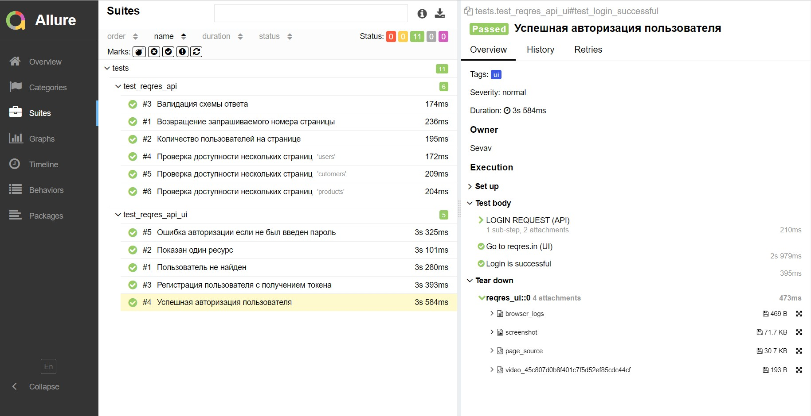
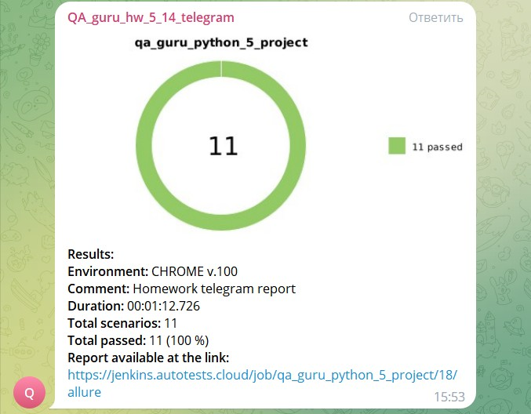

## Дипломный проект автотестов для сайта https://reqres.in/

### Проект совмещает UI и API тесты
* UI + API тесты
    * Регистрация пользователя с получением токена
    * Авторизация пользователя
    * Ошибка авторизации если не был введен пароль
    * Отображение ресурса
    * Пользователь не найден
* API тесты
    * Возвращение запрашиваемого номера страницы
    * Количество пользователей на странице
    * Валидация схемы ответа
    * Проверка доступности нескольких страниц

## Используемые технологии

  <code></code>
  <code></code>
  <code></code>
  <code></code>
  <code></code>
  <code></code>
  <code></code>
  <code></code>
  <code></code>
  <code></code>
  <code></code>

## Запуск тестов

##  Запуск тестов из [Jenkins](https://jenkins.autotests.cloud/job/qa_guru_python_5_project/)
Добавить проект в Jenkins и нажать кнопку "Собрать сейчас".

##  Пример [Allure](https://jenkins.autotests.cloud/job/qa_guru_python_5_project/19/allure/) отчетов

В отчетах Allure для каждого UI-теста прикреплен скриншот, лог, ресурс html-страницы и видео прохождения теста

##  Интеграция с [Allure TestOps](https://allure.autotests.cloud/launch/27144) 

##  Отправка отчета в Telegram

### Пример видео прохождения теста

  

